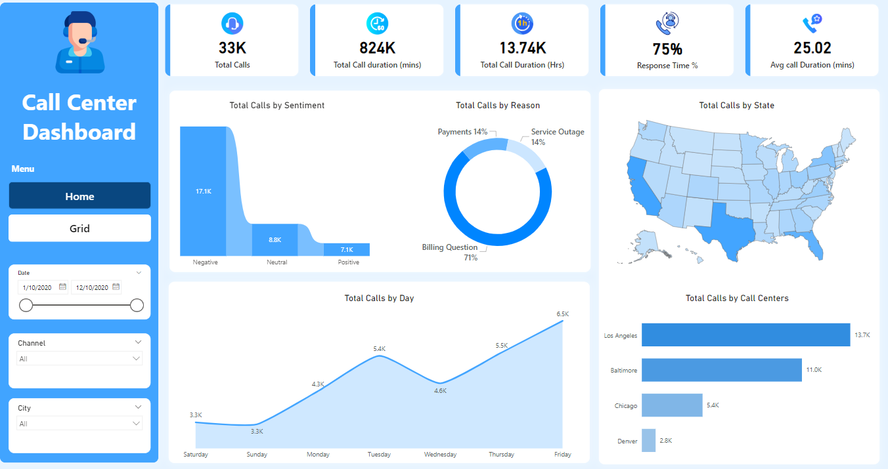
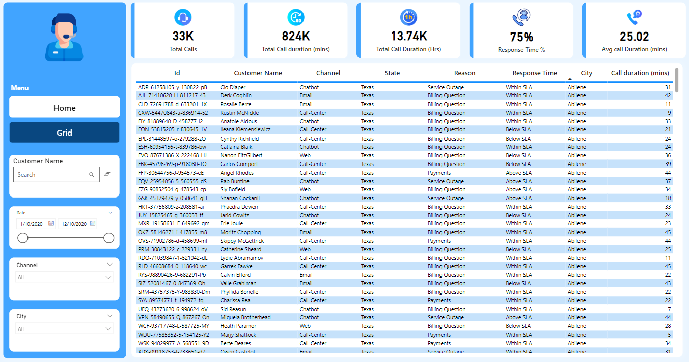

# Call Center Dashboard

This repository contains a **Call Center Dashboard** developed using **Power BI**. The dashboard provides key insights into call center performance, including KPIs, charts, and detailed call records.

---

## Dashboard Overview

### Home: KPIs and Charts  

### Grid: Detailed Data Table  

---

## 📊 Overview

The dashboard is designed to track and analyze key performance indicators (KPIs) and other critical metrics to monitor call center operations effectively. It includes:

1. **Key Metrics**  
   - Total Number of Calls  
   - Total Call Duration (Hours and Minutes)  
   - Average Call Duration  
   - Response Time Percentage  

2. **Visualizations**  
   - Total Calls by Sentiment  
   - Total Calls by Reason  
   - Total Calls by Day  
   - Total Calls by State  
   - Total Calls by Call Centers  

3. **Data Table View**  
   A detailed table displaying individual call data, including customer information, channel, state, call reason, response time, city, and duration.

---

## Files

- **Call Center Dashboard.pbix**: The Power BI dashboard file.  
- **Call center data.csv**: Source data used to build the dashboard.  
- **CallDash.png**: Screenshot of the KPI and Charts page.  
- **GridDash.png**: Screenshot of the Data Table page.  
- **README.md**: Project documentation.  

---

## Key Features

- **Comprehensive KPIs**: Track critical metrics such as response time and call duration.  
- **Data Filtering**: Select dates, channels, and cities for a focused analysis.  
- **Interactive Visuals**: Charts and maps to analyze call trends by day, sentiment, and location.  
- **Detailed Insights**: Drill into granular call data with the table view.

---

## How to Use

1. Open the **Call Center Dashboard.pbix** file in **Power BI Desktop**.  
2. Load or update the call center data from **Call center data.csv**.  
3. Explore the interactive visuals on both pages:  
   - **Home**: KPIs and charts.  
   - **Grid**: Detailed call records table.  

---

## Contact

For questions, feedback, or collaboration:  

- **Name**: Bahaa Medhat Wanas 
- **Email**: [your_email@example.com](mailto:bahaamedhat2022@gmail.com)  
- **LinkedIn**: [Your LinkedIn Profile](https://www.linkedin.com/in/bahaa-wanas-9797b923a)   

---
